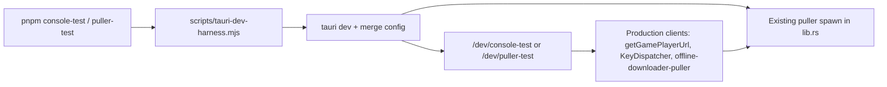

# Development test harnesses

Native, development-only workbenches for debugging the **puller proxy** and **touch console** injection paths without duplicating production logic.

| Command                                     | Window              | Purpose                                                                                                                                                                                               |
| ------------------------------------------- | ------------------- | ----------------------------------------------------------------------------------------------------------------------------------------------------------------------------------------------------- |
| `pnpm console-test`                         | Console Test (dev)  | Online/offline injection, TouchConsole, manual key/event commands, correlated acks                                                                                                                    |
| `pnpm puller-test`                          | Puller Test (dev)   | Puller health, download lifecycle, jobs, mirror verify, proxy play                                                                                                                                    |
| `pnpm desktop-theme-test -- --binary <app>` | the real app window | Linux desktop field test: launch colour, live light/dark switch, resize repaint, ghost windows — measured from compositor screenshots                                                                 |
| `pnpm bridge-test`                          | headless Chromium   | In-game bridge end to end: virtual storage (isolation, save, relaunch, fresh origin, postMessage pull), typed IndexedDB, live key detection, on-screen keyboard, single dispatch per press, Move mode |

`pnpm bridge-test` starts its own Vite dev server (or reuses one: `-- --url http://localhost:5173`), writes a fixture game to `static/games/_bridge-lab` and removes it afterwards. `-- --out <dir>` saves a screenshot of each stage; `CHROMIUM_PATH` picks the browser binary.

The Tauri scripts launch **Tauri debug** with a thin config override. The puller process is owned by Tauri (`src-tauri/src/lib.rs`) — the same lifecycle as `pnpm app`.

## Quick start

```bash
pnpm install
pnpm console-test   # or: pnpm puller-test
```

Do **not** run `pnpm dev` or `pnpm puller:start` in parallel. A second puller on `:18787` causes port fights. Tauri will reuse a healthy puller already listening on the default port when possible.

## Architecture



| Piece          | Path                                                                                                                                                             |
| -------------- | ---------------------------------------------------------------------------------------------------------------------------------------------------------------- |
| Launcher       | [`scripts/tauri-dev-harness.mjs`](../scripts/tauri-dev-harness.mjs)                                                                                              |
| Tauri configs  | [`src-tauri/tauri.console-test.conf.json`](../src-tauri/tauri.console-test.conf.json), [`tauri.puller-test.conf.json`](../src-tauri/tauri.puller-test.conf.json) |
| Routes         | [`src/routes/dev/`](../src/routes/dev/)                                                                                                                          |
| 30-game matrix | [`src/lib/dev-harness/test-games.ts`](../src/lib/dev-harness/test-games.ts)                                                                                      |
| Commands       | [`src/lib/dev-harness/commands.ts`](../src/lib/dev-harness/commands.ts)                                                                                          |

## Game selection (30 titles)

One shared curated list for both harnesses. Offline mirrors are **not** required up front — the goal is puller **proxy** + touch injection for online games, and the same injection path for offline mirrors when present.

Selection criteria:

- Control-oriented genres (action, platformer, racing, sports, skill, …)
- Mix of `unity` / `html5`
- Mix of `embed` / `generic` / `local-embed`
- Multiple portals (legacy, unity-play, playhop, crazygames, coolmath, addictinggames, drive-u-7)

Runtime status (offline / downloading) is probed via puller APIs.

## console-test

- Pick a game and **Online** / **Offline** mode (uses `saveGamePlayMode` + `getGamePlayerUrl`)
- Real `LazyGameFrame` + real `TouchConsole`
- Health strip: puller `/api/offline/health` + jobs
- Manual commands (allowlisted only):

| Command                            | Effect                                |
| ---------------------------------- | ------------------------------------- |
| `probe`                            | Resolve DOM vs bridge dispatch path   |
| `down` / `up` / `tap` `<KeyCode…>` | KeyDispatcher                         |
| `joystick <x> <y>`                 | Direction codes from vector           |
| `releaseAll`                       | Clear held keys                       |
| `pause` / `resume`                 | `potato-tomato-game-pause`            |
| `unlockAudio` / `mute` / `unmute`  | Audio bridge messages                 |
| `reload`                           | Re-resolve play URL and remount frame |

Acknowledgements:

- **Bridge path:** child scripts reply with `potato-tomato-touch-input-ack` when `ackId` is present
- **DOM path:** harness briefly observes `keydown`/`keyup` on the injectable document
- Timeline + play log show accepted → path → ack / timeout

## puller-test

Uses the same HTTP client as production (`offline-downloader-puller.ts`):

| Command                          | API                               |
| -------------------------------- | --------------------------------- |
| `health`                         | `GET /api/offline/health`         |
| `jobs`                           | `GET /api/offline/jobs`           |
| `status` / `progress`            | Per-game status / progress        |
| `download` / `cancel` / `delete` | Lifecycle                         |
| `verify`                         | Status + offline entry HTTP check |
| `playOnline` / `playOffline`     | Resolve URL and load iframe       |

Puller stdout also logs download start/done/error and unity-play / game-live session creation.

## Security / production gates

| Layer       | Gate                                                                                  |
| ----------- | ------------------------------------------------------------------------------------- |
| Scripts     | Only in root `package.json`; never used by release workflows                          |
| SvelteKit   | `/dev/+layout.ts` → 404 when `!import.meta.env.DEV`                                   |
| Root layout | Strips TopBar / privacy / play-limit for `/dev/*`                                     |
| Tauri       | `get_dev_harness_mode` returns empty outside debug; env allowlist                     |
| Commands    | Schema allowlist — no eval, no arbitrary HTTP/shell                                   |
| Puller      | Existing catalog ID checks, path traversal protection, live URL safety, loopback bind |

## Logging & export

- Shared ring buffer: `appendPlayLog` / `formatPlayLogForCopy`
- Harness timeline panel (copy + download as `.txt`)
- Scopes: `harness`, `harness-manual`, `puller-health`, `puller-download`, `play-url`

## Troubleshooting

| Symptom                        | Fix                                                                                                                |
| ------------------------------ | ------------------------------------------------------------------------------------------------------------------ |
| Puller offline in health strip | Wait for Tauri spawn; check terminal for `[puller]`; close Flatpak / `pnpm dev`                                    |
| Wrong port                     | Tauri may reserve `18787+`; UI syncs via `get_puller_base_url`                                                     |
| Touch “blocked”                | Online titles need puller proxy (`/api/unity-play` or `/api/game-live`); shell-only online URLs are not injectable |
| Bridge ack timeout             | Ensure game loaded through puller (inject/bridge present); retry `probe` after iframe load                         |
| Catalog missing game           | Run importers / `node scripts/generate-games-list.js`; harness IDs must exist in catalog                           |

## desktop-theme-test (Linux, GNOME/Wayland)

Drives a **real build** of the app on the live desktop and measures what the
compositor shows, because the bugs it exists for are invisible from inside the page:
a white window under a dark desktop before the page paints, a second "ghost" window,
the old scheme showing through while the window is resized, and a desktop light/dark
switch the page never hears about.

```bash
# dev-mode binary (loads Vite; the harness starts it), cold Vite for every launch
pnpm desktop-theme-test -- --binary src-tauri/target/debug/potato-tomato --dev-server --cold
# embedded build (`tauri build --debug`-style: cargo build --features tauri/custom-protocol)
pnpm desktop-theme-test -- --binary src-tauri/target/debug/potato-tomato
# same, with the primary monitor temporarily at 2× (restored on exit)
pnpm desktop-theme-test -- --binary ... --scale 2 --skip-switch --skip-resize
```

Per scheme (dark, then light) it: sets `org.gnome.desktop.interface color-scheme`,
screenshots the empty desktop, launches the app and captures frames until the page
reports itself loaded, asks the page (WebKit remote inspector on `127.0.0.1:9223`) for
`prefers-color-scheme` / `.dark` / resolved colours, flips the desktop scheme under the
running app and times the follow, then maximizes, restores and keyboard-resizes the
window while capturing. Output: `docs/field-tests/desktop-theme-<date>/REPORT.md`

- `report.json`, with the referenced frames cropped to the app window. Exit code is
  non-zero when any check fails. The desktop scheme (and monitor scale) are restored on
  exit, including Ctrl-C.

Needs: `gsettings`, the `gdr` desktop daemon with `gdr-mcp` on `PATH` (screenshots and
key chords), and no other `puller-sidecar` from a previous run (`pkill -x puller-sidecar`
— a healthy leftover puller changes launch timing). Findings from the first run, and
what was fixed from them, are in the dated report directory.

## Related docs

- [touch-console.md](./touch-console.md)
- [offline-downloader.md](./offline-downloader.md)
- [native-first.md](./native-first.md)
