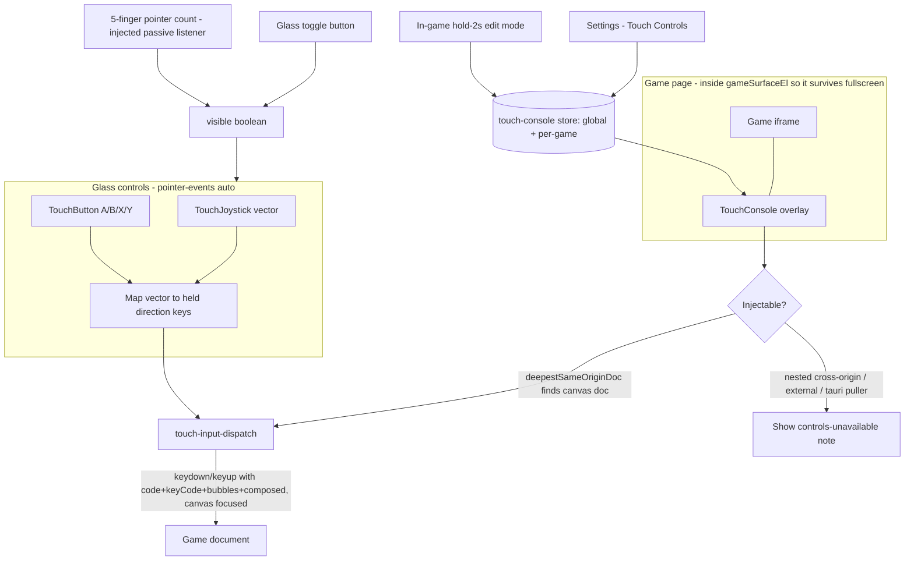

# Universal Touch Console

Glassmorphic on-screen gamepad for mobile (and optional desktop) play. Turns joystick / button touches into synthetic `KeyboardEvent`s dispatched **only into the game iframe document** — never the parent app window.

## Why this exists

Most of the 7000+ catalog games are desktop HTML5 / Unity builds that listen for keyboard (and sometimes mouse), not touch. Rather than patching every game, Potato Tomato overlays one translator that maps touch → the keys each game already understands.

## Architecture



### Isolation guarantees

1. **Overlay → page:** the overlay root is `pointer-events: none`; only widgets (joystick, buttons, toggle, drag handle) are `pointer-events: auto`. Touches that miss a widget pass through to the game.
2. **Overlay → game only:** `KeyDispatcher` targets `iframe.contentDocument` / nested same-origin docs. It never calls `window.dispatchEvent` on the parent.

### Same-origin matrix (injectability)

| Play URL pattern | Top iframe vs app | Game document injectable? |
|------------------|-------------------|---------------------------|
| `/games/{id}/offline/…` | Same-origin | **Yes** |
| `/puller-games/{id}/offline/…` (dev proxy) | Same-origin | **Yes** |
| `/browser-offline/{id}/…` | Same-origin | **Yes** if fully mirrored; **No** if shell only wraps external iframe |
| `/api/unity-play/{id}` (dev proxy) | Same-origin | **Yes** (Unity in top doc) |
| `blob:…` | Same-origin | Same as browser-offline |
| `/unity/player.html?src=…` | Same-origin shell | **No** — nested cross-origin `#game` |
| `/games/{id}/online/index.html` | Same-origin shell | **No** — nested external embed |
| Direct `https://…` embed | Cross-origin | **No** |
| `http://127.0.0.1:18787/…` (Tauri packaged puller) | Cross-origin | **No** via parent `contentDocument` |

Expanding puller mirroring ([offline-downloader.md](./offline-downloader.md)) is what unlocks control coverage for more of the catalog. A future cross-origin `postMessage` guest bridge is planned for packaged Tauri + live embeds.

Live probe: `resolveInjectable(iframe)` in [`src/lib/utils/touch-input-dispatch.ts`](../src/lib/utils/touch-input-dispatch.ts) recurses nested same-origin frames (same pattern as `broadcastGamePause`) and prefers the deepest document with a canvas.

## Gestures and UX

| Action | Behavior |
|--------|----------|
| Gamepad toggle button | Always visible (when enabled / availability allows). Same `visible` boolean as the gesture. |
| Five-finger tap | ≥5 simultaneous pointers on the same-origin game doc toggles overlay. Debounced ~300ms against the button. |
| Joystick | Analog stick → 8-way direction keys (Arrows + WASD by default). |
| A / B / X / Y | Hold = keydown, release = keyup (Space / Enter / Shift / Esc by default). |
| Hold 2s on a control | Enter drag mode (dashed highlight), move, release commits to store. |
| Hold 2s on panel grip | Drag the whole compact console rectangle. |
| Pause / privacy lock | Overlay hides and all keys are released. |

## Data model

**Global** — `localStorage` key `potato-tomato-touch-console-v1`:

```ts
{
  version: 1,
  enabled: true,
  availability: 'auto' | 'always' | 'off',
  opacity: 0.72,
  scale: 1,
  haptics: true,
  layouts: { landscape: TouchLayout, portrait: TouchLayout },
  mapping: {
    directions: { up, down, left, right }, // KeyboardEvent.code[]
    buttons: { a, b, x, y }
  }
}
```

**Per-game override** — `potato-tomato-touch-console-game-{id}` (sparse layouts / mapping).

Positions are **viewport percentages** so layouts survive screen size and orientation changes. Event: `potato-tomato-touch-console-changed`.

API: [`src/lib/utils/touch-console.ts`](../src/lib/utils/touch-console.ts).

## Settings

**Settings → Touch Controls** ([`TouchControlsSection.svelte`](../src/lib/components/settings/sections/touch-controls/TouchControlsSection.svelte)):

- Enable / availability / opacity / scale / haptics
- Landscape / Portrait tabs with live preview drag editor + size sliders
- Copy landscape → portrait, reset
- Key mapping recorder (same pattern as Games pause shortcut)

## Source map

| Path | Role |
|------|------|
| `src/lib/utils/touch-console.ts` | Persistence + defaults |
| `src/lib/utils/touch-input-dispatch.ts` | Injectability + `KeyDispatcher` |
| `src/lib/components/game-player/touch-console/` | Overlay UI |
| `src/lib/components/settings/sections/touch-controls/` | Settings panel |
| `src/routes/games/[gameId]/+page.svelte` | Mount point inside `gameSurfaceEl` |

## Design history (assets)

Assets live in [`docs/touch-console/assets/`](./touch-console/assets/) in chronological order from the design conversation:

1. **Problem — uncomfortable mobile chrome**  
   - [`uncomfortable-layout-compact.png`](./touch-console/assets/uncomfortable-layout-compact.png) — early game detail page: stacked Favourite / Dislike / Logs / Pause / Relaunch, little room for play.  
   - [`uncomfortable-layout-with-fullscreen.png`](./touch-console/assets/uncomfortable-layout-with-fullscreen.png) — same flow with Fullscreen + offline download card; still meta-actions, not in-game controls.

2. **Architecture flowchart (conversation)** — origin check → gesture layer → overlay hold/drag → input translator (see mermaid above).

3. **First labeled mockup** — [`universal-console-mockup.svg`](./touch-console/assets/universal-console-mockup.svg)  
   Landscape overlay legend: five-finger zone, joystick, hold-2s drag, A/B, manual toggle, settings, orientation, size.

4. **Refined compact glass console** — [`compact-glass-console.svg`](./touch-console/assets/compact-glass-console.svg)  
   Single frosted rectangle, drag handle, glass stick, clustered A/B/Y, optional second rectangle for twin-stick (deferred).

5. **Compact game page chrome** — [`compact-game-page.html`](./touch-console/assets/compact-game-page.html)  
   Proposed pre-play mobile layout (Play Now, Online/Offline segmented control, icon action grid) to reduce choice overload before the overlay takes over during play.

## Follow-ups (not in v1)

- Cross-origin guest `postMessage` bridge (packaged Tauri puller, live embeds, nested Unity)
- Same-origin proxy for `/api/unity-play` outside Vite dev
- Broader puller `generic` mirroring coverage
- Genre / engine mapping presets + crowdsourced profiles
- Hardware gamepad passthrough and virtual trackpad / cursor mode
